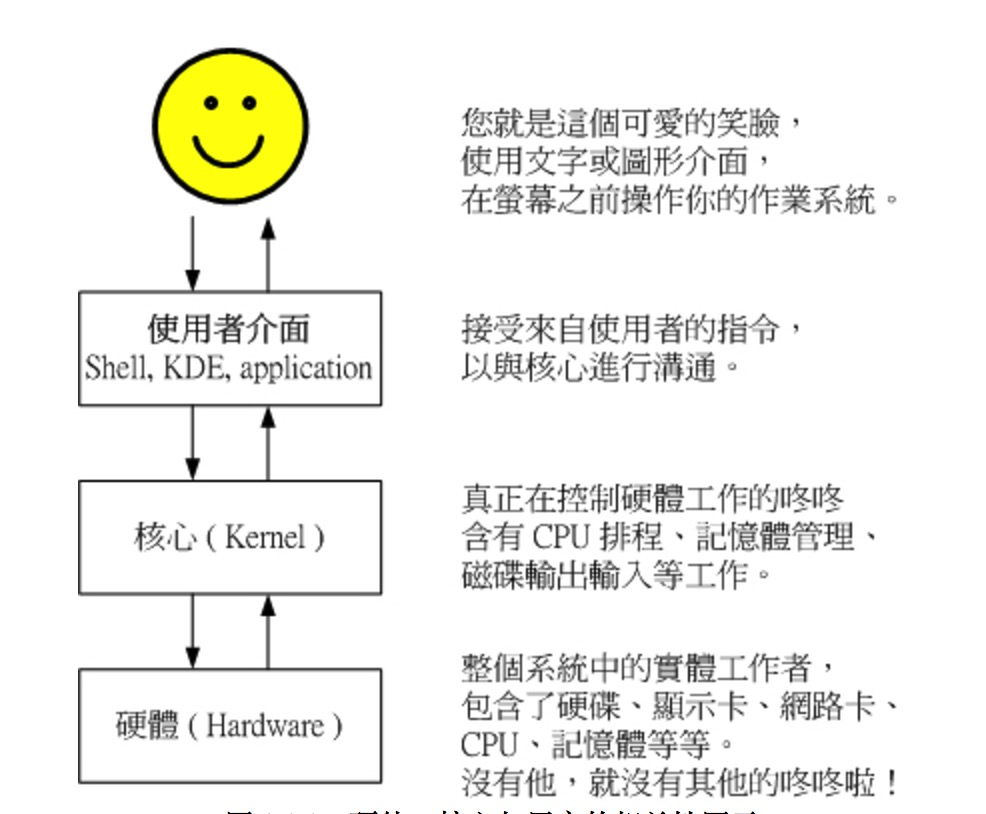

# bash 跟着敲

## 1. 硬件、内核、shell

下面这张摘自鸟哥的图可以很好的说明


## 2. 命令行

### 1. 基本操作

* export

展示全部的环境变量，如果你想获取某个特殊的变量，用 `echo $变量名`


* whatis

展示用户命令，系统调用、库函数等


* whereis

搜索可执行文件、源文件


* which

在环境变量中搜索可执行文件，并打印完整路径


* clear

清空屏幕


### 2. 文件操作

* cat

在屏幕上显示文本文件


* chmod

可以改变文件和目录的读、写、执行权限
[linux 中的用户、组、文件][1]

* cp

复制文件


* diff

比较文件，我在上面复制的文件中加了一行diff


* find

查找文件，可以通过正则来查


* head

查看文件前10行


* ls

显示所有文件，`-l`显示长格式化 `-a`显示包括隐藏文件


* mv

移动文件，同时也可以重命名文件


* rm

删除文件，`-r`删除目录 `-f`强制删除


* touch

创建新文件


### 3. 文本操作

* awk

非常有用的一个文本处理命令，逐行运行，默认使用空格分割，`-F`表示分割的样式


* grep

匹配正则表达式的文本行，并输出，`-E`正则模糊匹配 `-F`精确字母匹配 `-w`精确单词匹配


* sed

正则替换


* sort

排序


* wc

统计文本行数，单词数，字符数


### 3. 目录操作

* cd

进入目录

* mkdir

创建目录

* pwd

当前目录的路径


### 4. SSH,系统信息，网络操作

* cal

月历


* date

当前日期和时间


* df

磁盘使用情况

* du

文件或目录使用情况


* ps

列出你的进程


* ssh

远程连接


* top

列出当然活动进程


## 3, 语法

### 1 条件判断

#### 1.1 test判断语句

test是关键字，表示判断；EXPRESSION是被判断的语句。


`echo $?` 输出判断结果，0表示成功，其他表示失败。


#### 1.2 []条件判断

中括号的左右扩弧和EXPRESSION之间都必须有空格！


文件类型判断

字符串和数字判断


### 2 if then else语句

例子1：判断文件README.md是不是文件

```sh
#!/bin/bash

if [ -f ../README.md ];then
echo 'file exist'
else
echo 'file not exist'
fi

exit 0
```

例子2：提示用户输入值，如果大于0输出’正数’，小于0输出’负数‘，等于0输出’零‘

```sh
#!/bin/bash

# 提示用户输入一个值
echo -n "请输入一个数字："

# 保存用户输入的值到num中
read num

if [ "$num" -gt 0 ];then
echo '正数'
elif [ "$num" -lt 0 ];then
echo '负数'
else
echo '零'
fi

exit 0
```

### 3 case语句

例子：提示用户输入Y/y或N/n。若输入Y/y，则输出“我们约起来吧”；若输入N/n,则输出“不约，再见”；否则，“输入有误”

```sh
#!/bin/bash

echo -n "你单身吗？(y/n)"

read val

case $val in
Y|y)
echo "我们约起来吧"
;;
N|n)
echo "不约，再见"
;;
*)
echo "输入有误"
;;
esac

exit 0
```

### 4 for循环

例子：输出当前文件夹的一级子目录中文件名字

```sh
#!/bin/bash

# 将ls的结果保存到变量CUR_DIR中
CUR_DIR=`ls`

# 显示ls的结果
echo $CUR_DIR

for val in $CUR_DIR
do
if [ -f $val ];then
echo "FILE: $val"
fi
done

exit 0
```

### 5 while循环

例子：从0开始逐步递增，当数值等于5时，停止递增

```sh
#!/bin/bash

val=0

while [ "$val" -lt 5 ]
do
echo "val=$val"
((val++))
done

exit 0
```

### 6 使用break和continue控制循环

break命令允许跳出循环

continue命令类似于 break命令,只有一点重要差别,它不会跳出循环,只是跳过这个循环步。

例子1：[break应用]从0开始逐步递增，当数值等于5时，停止递增。

```sh
#!/bin/bash

# 设置起始值为0
val=0

while true
do
if [ "$val" -eq "5" ];then
# 如果val=5，则跳出循环
break;
else
# 输出数值
echo "val=$val"
# 将数值加1
((val++))
fi
done

exit 0
```

例子2：[continue应用]从0开始逐步递增到10：当数值为5时，将数值递增2；否则，输出数值

```sh
#!/bin/bash

# 设置起始值为0
val=0

while [ "$val" -le "10" ]
do
if [ "$val" -eq "5" ];then
# 如果val=5，则将数值加2
((val=$val+2))
continue;
else
# 输出数值
echo "val=$val"
# 将数值加1
((val++))
fi
done

exit 0
```

## 4. 数组

翻车了-_-!
[1]:http://omgzui.pub/linux